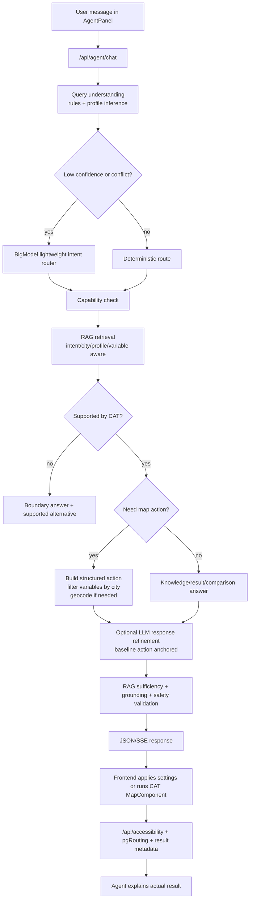

# AI 产品经理面试项目资料：InclusiveSpace CAT Accessibility Agent

> 使用方式：这份资料不是简历描述，而是面试“弹药库”。面试中先用 30 秒讲清项目价值，再根据问题切换到需求、功能、技术、指标、难点、取舍、复盘任一层级。

## 0. 一句话项目定位

InclusiveSpace CAT 是一个面向城市步行无障碍与舒适可达性的 Web GIS 工具。我的 AI Agent 工作，是把用户的自然语言需求转成可检查、可执行、可解释的 CAT 地图分析动作，并严格控制 AI 不编造空间结论：Agent 负责理解需求、检索知识、生成结构化 action 和解释，真实空间计算仍由现有地图、pgRouting、GeoJSON 数据和结果 metadata 完成。

面试中可以这样说：

> 这个项目不是做一个泛聊天机器人，而是把 AI 嵌入一个专业 GIS 决策工具里。核心产品目标是降低用户配置可达性分析的门槛，同时保证输出可验证：AI 不直接算地图，不编造路线和空间事实，只负责把用户需求翻译成 CAT 能执行的参数、动作和解释。

## 1. 项目背景与问题定义

### 1.1 业务背景

CAT 全称 Comfort-based Accessibility Tool，是一个基于舒适度因素的步行可达性分析工具。它面向城市规划、无障碍设计、公共空间评估等场景，帮助用户理解一个起点在给定步行时间、速度、环境因素影响下，可以舒适到达哪些区域。

传统可达性工具通常只回答“能不能到达”，但这个项目进一步回答“对不同人群来说，是否舒适、是否现实可达”。比如同样 15 分钟步行范围，对普通成年人、老人、轮椅使用者、视障用户、推婴儿车家庭来说，受影响的因素完全不同。

### 1.2 用户痛点

1. 配置门槛高：用户需要知道该选哪些 comfort variables，例如 stair、slope、kerbsHigh、poorPavement、trafficLight 等。
2. 专业术语难懂：变量名称和 GIS 分析逻辑对普通用户不友好。
3. 不同城市数据可用性不同：Hamburg 有的变量，Penteli 不一定有，用户不知道哪些能用。
4. 结果解释困难：用户看到默认可达范围和 comfort-adjusted area，不一定理解 comfort ratio 意味着什么。
5. AI 风险明显：如果让 LLM 直接回答“哪里最适合老人散步”“最近的咖啡馆是哪家”，它很容易越权、编造空间事实或给出工具不支持的结论。

### 1.3 产品机会

AI Agent 可以补足用户和专业 GIS 系统之间的“理解层”：

1. 把自然语言需求转成参数设置。
2. 根据用户画像推荐一组初始变量和影响程度。
3. 检查城市是否支持对应变量。
4. 引导用户选择起点或运行真实分析。
5. 在有真实结果后解释 metadata。
6. 对工具能力边界做清晰说明，避免误导用户。

### 1.4 北极星目标

让非专业用户也能完成一次可信的舒适步行可达性分析：从“我父亲 78 岁，走路慢，想看这里适不适合散步”到“系统准备好参数、应用到地图、运行 CAT 计算、解释结果和限制”。

## 2. 需求拆解

### 2.1 用户角色

1. 普通居民：想知道某个地点附近是否适合自己或家人步行。
2. 老人/照护者：关心台阶、坡度、路面、照明、公共交通和厕所。
3. 轮椅使用者：关心台阶、高路缘、坡度、窄路、破损路面、无障碍厕所。
4. 视障用户：关心触觉铺装、照明、过街信号、障碍物和人流。
5. 推婴儿车家庭：关心窄路、高路缘、台阶、障碍、设施、绿地。
6. 城市规划或研究人员：需要比较不同起点、解释结果、理解数据限制。

### 2.2 核心用户故事

1. 作为老人照护者，我想输入“我父亲 78 岁，走路慢，这里适合散步吗”，系统能识别老人画像并准备分析参数。
2. 作为轮椅用户，我想知道“Hamburg Hauptbahnhof 附近轮椅通行方便吗”，系统能识别地点、画像、变量，并在可运行时生成分析动作。
3. 作为普通用户，我想问“Penteli 有没有 noise 数据”，系统能回答数据可用性，而不是错误地发起分析。
4. 作为用户，我想问“这个结果是什么意思”，系统能根据最新真实结果解释 comfort ratio、面积和注意事项。
5. 作为用户，我想问“和刚刚那个点比呢”，系统能记住上一轮分析并比较当前点。
6. 作为用户，我可能会问“最近的咖啡馆是哪家”或“从 A 到 B 最舒服的路线”，系统需要说明 CAT 当前不支持具体 POI 排名和 OD 路线导航，并提供可支持的替代分析。

### 2.3 需求优先级

P0：

1. 准确识别用户意图：知识问答、数据可用性、结果解释、地图分析、边界问题、比较问题。
2. 生成结构化 action：能被前端应用到地图状态，而不是只返回自然语言。
3. 城市变量过滤：不支持的变量不能被应用，必须给出 missing data warning。
4. 安全边界：不泄露密钥、不输出 SQL、不输出 raw GeoJSON、不编造地图事实。
5. 结果解释必须基于 resultMetadata。

P1：

1. 多语言支持：中文、英文、德文等输入能路由到正确意图。
2. 轻量 LLM router：只在规则冲突或低置信度时调用，降低成本和延迟。
3. RAG rerank 和 coverage guardrail：保证检索结果覆盖 profile、variables、cities、methodology 等关键证据。
4. 分析历史记忆：支持“刚刚那个结果”“现在这个点”等追问。
5. SSE 流式反馈：让用户看到“正在理解问题、检查能力、准备回答”等状态。

P2：

1. 更细粒度埋点与线上指标。
2. 人工标注评测集，减少 synthetic eval 过拟合。
3. 更多城市与更多数据源接入。
4. 更短 LLM answer timeout 和更多 deterministic template。

## 3. 功能矩阵

### 3.1 用户侧功能

1. 自然语言咨询：用户在侧边栏 AgentPanel 输入问题。
2. 示例问题：新会话显示示例，引导用户理解能力范围。
3. AI 生成建议设置：系统给出 walking speed、walking time、comfort factors、影响程度。
4. 一键应用设置：用户可以把 agent action 应用到 CAT 地图参数。
5. 一键运行真实计算：在有起点时，触发地图现有分析流程。
6. 结果解释：运行后自动或手动解释最新 CAT result metadata。
7. 历史比较：保存最近分析记录，支持当前点和上一点比较。
8. 后续建议：返回 followUpSuggestions，引导用户选择下一步。

### 3.2 Agent 支持的意图

核心意图来自 `utils/agentIntent.js` 和安全白名单：

1. `catchment_area_analysis`：从起点计算可达范围。
2. `area_suitability_question`：判断当前区域是否适合某类步行需求。
3. `run_accessibility_analysis`：显式要求运行分析。
4. `parameter_recommendation`：推荐参数。
5. `explain_variable`：解释变量含义。
6. `ask_data_availability`：回答城市/变量数据是否可用。
7. `explain_result`：解释最新结果。
8. `compare_with_previous_result`：比较当前和之前结果。
9. `compare_profiles`：比较用户画像预设。
10. `how_to_use`：解释如何使用 CAT。
11. `troubleshooting`：排查没有结果、地图不更新等问题。
12. `route_recommendation`：识别为不完全支持的路线需求。
13. `specific_poi_query`：识别为不支持的具体 POI 排名或最近地点需求。
14. `citywide_place_recommendation`：识别为不支持的全城地点推荐需求。
15. `general_question`：一般知识问题。

### 3.3 用户画像预设

画像定义在 `components/agent/profilePresets.js`：

1. Elderly：默认 3.0 km/h，关注 stair、slope、unevenSurface、poorPavement、kerbsHigh、obstacle、trafficLight、station、wcDisabled、light。
2. Wheelchair user：默认 3.0 km/h，强关注 stair、kerbsHigh、slope、narrowRoads、poorPavement、unevenSurface、obstacle、wcDisabled、trafficLight。
3. Visually impaired：默认 4.0 km/h，关注 tactile_pavement、light、trafficLight、obstacle、pedestrianFlow。
4. Children/family/stroller：默认 3.5 km/h，关注 narrowRoads、kerbsHigh、stair、obstacle、poorPavement、unevenSurface、trafficLight、facility、greeninf、light。
5. Default adult：默认 5.0 km/h，关注 light、trafficLight、station、facility、greeninf、noise。

面试表达重点：画像不是给用户贴标签，而是“快速起点”。用户最终仍能审查和调整变量。这样可以避免把群体预设当作个人真实情况。

## 4. Agent 技术实现总览

### 4.1 主链路

新版主链路在 `pages/api/agent/chat.js` 和 `utils/agentChat.js`：

1. 前端收集 message、city、currentMapState、resultMetadata、conversationHistory、analysisHistory。
2. `/api/agent/chat` 接收请求，支持普通 JSON 或 SSE 流式响应。
3. `buildAgentChatResponse` 执行 agent pipeline。
4. `understandAgentQuery` 做确定性意图识别、语言识别、slot 提取、profile inference。
5. 如低置信度或信号冲突，`maybeClassifyIntentWithLlm` 调用 BigModel 作为轻量 intent router。
6. `checkAgentCapability` 判断当前意图是否在 CAT 能力范围内。
7. `retrieveKnowledge` 按 intent、city、profile、variable 检索知识库。
8. 根据能力与意图构建 action、reply、alternativeAction。
9. 可选调用 `maybeBuildLlmAgentResponse` 优化自然语言和 action，但以 baseline safe action 为锚。
10. `evaluateRagSufficiency`、`selectAnswerMode`、`runFinalGroundingCheck`、`validateAgentAction`、`validateAgentReply` 做质量和安全检查。
11. 返回结构化响应：reply、intent、answerMode、detected、action、alternativeAction、followUpSuggestions、capabilityCheck、ragSufficiency、groundingCheck、missingDataWarnings、citations、retrieval、debug。
12. 前端展示自然语言、建议设置、下一步按钮，并在用户确认后应用到地图或运行真实计算。

### 4.2 架构图



### 4.3 为什么这样设计

核心取舍：让 LLM 做它擅长的语言理解和表达，但不让它做不可验证的空间计算。

1. 规则优先：高频、风险明确的问题走 deterministic path，速度快、可控。
2. LLM 兜底：只在低置信度、多语言、语义冲突时路由，不把所有请求都交给模型。
3. RAG 只存文本和元数据：不放 raw geometry、道路网络、POI 坐标、catchment polygons。
4. 结构化 action：前端能检查、展示、应用，而不是盲目执行自然语言。
5. 能力边界前置：路线导航、最近 POI、全城地点推荐等不支持能力先说明限制，再给替代方案。
6. 结果解释后置：只有在真实 resultMetadata 存在时才解释空间结论。

## 5. Agent 模块详解

### 5.1 Query Understanding

相关文件：

1. `utils/agentIntent.js`
2. `utils/agentQueryUnderstanding.js`
3. `utils/profileInference.js`

功能：

1. 检测城市：Hamburg、Penteli。
2. 检测变量：noise、light、trafficLight、stair、slope、kerbsHigh 等。
3. 检测画像：老人、轮椅、视障、推婴儿车、默认成人。
4. 检测地点：例如 Hamburg Hauptbahnhof，或中文“汉堡中央车站”。
5. 检测 unsupported intent：路线、最近 POI、全城推荐。
6. 建立 retrievalQuery：把多语言问题转换成适合检索的英文提示。

关键设计：priority gate。

以前的问题是，只要用户提到“老人、步行、Hamburg”，系统就容易进入 action intent。P0/P1 改成优先识别知识/边界/排障/比较类问题：

1. troubleshooting
2. explain_variable
3. ask_data_availability
4. compare_with_previous_result
5. explain_result
6. how_to_use
7. specific_poi_query
8. route_recommendation
9. action intents

面试可讲：

> 我们发现 agent 的最大错误不是模型不会生成 JSON，而是第一步把用户目标理解错了。因此我把路由从“看到 profile/place 就触发分析”改成“先判断用户目标和能力边界”，并加了 priority gate。这个改动让知识问题不再被 action fast path 抢走。

### 5.2 Capability Check

相关文件：`utils/agentCapabilities.js`

作用：判断用户目标是否被 CAT 完整支持、部分支持或不支持。

支持：

1. 可达区域分析。
2. 区域适宜性估计。
3. 参数推荐。
4. 变量解释。
5. 数据可用性。
6. 结果解释。
7. 历史结果比较。
8. 工具使用说明和 troubleshooting。

不直接支持：

1. A 到 B 的路线导航。
2. 最近/最佳 POI 排名。
3. 全城地点推荐。

产品意义：

1. 防止 AI 过度承诺。
2. 把“不支持”转化为“可替代任务”，例如“不能给你从 A 到 B 最舒服路线，但可以从起点计算舒适可达范围”。
3. 帮用户形成正确预期。

### 5.3 RAG Knowledge Retrieval

相关文件：

1. `utils/agentKnowledge.js`
2. `utils/ragIndex.js`
3. `knowledge/`
4. `data/agent_knowledge_chunks.json`

知识库内容：

1. 城市数据可用性：Hamburg、Penteli 支持哪些变量和图层。
2. 用户画像：elderly、wheelchair_user、visually_impaired、children_family、default_adult。
3. comfort variables：每个变量的含义、适用人群、推荐值。
4. 方法论：CAT workflow、routing logic、result interpretation、data limitations、RAG boundary。
5. FAQ：如何使用、排障。

检索策略：

1. 先按意图决定 collection，例如 explain_variable 只查 variables，ask_data_availability 查 cities + methodology。
2. 同时考虑 city、profile、variable_key 元数据过滤。
3. 支持本地 chunks、旧 JSON index、数据库向量检索。
4. hybrid score：semantic、lexical、metadata boost。
5. rerank：按 intent/source/metadata/query coverage 加权。
6. coverage guardrail：确保 action 类问题至少覆盖 profile、variables、city；数据问题覆盖 city + data limitations；结果解释覆盖 result interpretation + variables。

面试表达：

> RAG 在这个项目中不是为了让模型“知道更多”，而是为了限定模型只能在项目知识边界内回答。比如它能解释 Penteli 没有 wheelchair toilet 数据，但不能根据知识库推断某个具体街角有多少台阶，因为那属于空间事实，必须来自地图计算。

### 5.4 Structured Action

相关文件：`utils/agentChat.js` 的 `buildRunAction`

action 示例：

```json
{
  "type": "RUN_ACCESSIBILITY_ANALYSIS",
  "profile": "wheelchair_user",
  "city": "hamburg",
  "locationText": "Hamburg Hauptbahnhof",
  "coordinates": [10.0064, 53.5528],
  "walkingTime": 15,
  "walkingSpeed": 3,
  "enabledVariables": ["stair", "kerbsHigh", "slope", "poorPavement"],
  "layerValues": {
    "stair": 0.1,
    "kerbsHigh": 0.2,
    "slope": 0.3,
    "poorPavement": 0.3
  },
  "requiresStartPoint": false,
  "canRunNow": true,
  "nextStep": "apply_and_run",
  "missingDataWarnings": []
}
```

如果没有坐标：

```json
{
  "type": "ASK_USER_TO_SELECT_POINT",
  "requiresStartPoint": true,
  "canRunNow": false,
  "nextStep": "select_start_point"
}
```

为什么重要：

1. UI 可以展示“建议设置”，让用户确认。
2. 前端可以应用变量、速度、时间、起点。
3. 可以把 AI 输出和真实计算分离。
4. 可以用 schema 和安全规则验证。

### 5.5 City Variable Filtering

相关文件：`utils/cityVariableFiltering.js`、`components/cityVariableConfig.js`

问题：不同城市支持的变量不同。

Hamburg 支持很多变量：noise、light、tree、trafficLight、tactile_pavement、temperatureSummer、temperatureWinter、greeninf、blueinf、station、wcDisabled、narrowRoads、stair、obstacle、slope、unevenSurface、poorPavement、kerbsHigh、facility、pedestrianFlow 等。

Penteli 支持较少变量：trafficLight、greeninf、temperatureSummer、temperatureWinter、station、stair、slope、facility、pedestrianFlow。

处理方式：

1. 根据 city 获取 supportedVariables。
2. preset 里的 enabledVariables 先过滤。
3. 用户明确请求的变量如果不支持，生成 warning。
4. 不支持的 layerValues 不传给前端。
5. 对缺失的支持变量填默认值 0.7。

面试可讲：

> 这是一个产品可信度问题。如果轮椅画像默认包含 kerbsHigh，但 Penteli 没有这个数据，系统不能假装用上了，而是要过滤掉并告诉用户“这个变量在 Penteli 不可用”。这比静默失败更符合 AI 产品的可解释性。

### 5.6 Geocoding

相关文件：`utils/agentGeocode.js`

处理：

1. 本地 known location 优先，例如 Hamburg Hauptbahnhof。
2. 其他地点用 Nominatim geocoding。
3. 如果 geocode 失败，不强行运行分析，而是要求用户在地图上选点。

产品取舍：

1. 常用地点本地化，提升稳定性和速度。
2. 外部 geocoding 失败时安全降级。
3. 不把模糊地名当成可靠坐标。

### 5.7 LLM Router 与 LLM Response Refiner

相关文件：

1. `utils/agentLlm.js`
2. `utils/bigModelClient.js`

LLM router：

1. 只分类，不回答。
2. 输入 deterministicCandidate 和 signals。
3. 输出 intent、profile、city、variable_key、locationText、isActionRequest、needsMapPoint、confidence、reason。
4. 只在低置信度、routing conflict、多语言、边界风险时调用。
5. timeout 默认 6 秒，max tokens 默认 500。
6. 失败时回退 deterministic routing。

LLM response refiner：

1. 输入 baselineSafeAction、baselineSafeReply、retrievedKnowledge、currentMapState、resultMetadata。
2. 要求 JSON only。
3. 不能输出 runnable action，除非 baseline action 已经可运行。
4. 不能加入不支持变量。
5. 输出后还要 normalize、filter、validate。

为什么不是纯 LLM：

1. 成本更低。
2. 高频路径更快。
3. 结果可控。
4. 失败可回退。
5. 更容易评测。

### 5.8 Safety 与 Grounding

相关文件：

1. `utils/agentSafety.js`
2. `utils/agentAnswerQuality.js`

安全策略：

1. SAFE_ACTION_TYPES：只允许预定义动作。
2. SAFE_CITIES：只允许配置中的城市。
3. SAFE_INTENTS：只允许已知意图。
4. SAFE_PROFILES：只允许 profile presets。
5. SAFE_VARIABLES：只允许城市配置支持变量，排除 ramp 等受限变量。
6. validateAgentReply：阻止 SQL、凭证、raw GeoJSON、coordinates 等敏感内容出现在回复中。
7. safeFallback：验证失败时返回保守回答。

Grounding 策略：

1. unsupported intent 必须明确说限制。
2. route/POI 不得给出“最佳路线是”“最近的是”这种过度结论。
3. action 必须匹配用户目标。
4. explain_result 必须基于 resultMetadata。
5. 若原问题是 unsupported，但用户后来运行了替代分析，解释结果时要说明“这个结果不能直接回答原完整请求，只能帮助理解起点周边可达范围”。

### 5.9 Memory 与 Follow-up

相关文件：

1. `components/AgentPanel.jsx`
2. `utils/agentMemory.js`

前端保存：

1. chatMessages 最近 30 条。
2. conversationHistory 最近 20 条。
3. analysisHistory 最近 20 条。
4. lastAgentContext。

支持场景：

1. 用户说“和刚刚比呢”。
2. 用户选择新起点后，系统提示可以沿用上次设置做公平比较。
3. 多个候选点分析后，系统可以比较 comfort ratio、adjusted area、POI count。

产品价值：

1. 从单轮问答变成任务型助手。
2. 支持用户自然追问。
3. 比较逻辑依赖真实历史结果，而不是模型记忆幻觉。

## 6. Web GIS 与真实计算关系

虽然面试重点是 AI PM，但要知道 agent 和 GIS 的边界。

现有地图分析流程：

1. 用户选择 city、walking time、walking speed、start point、comfort variables。
2. 前端调用 `/api/accessibility`。
3. 后端使用 PostgreSQL + pgRouting：
   1. 找最近 road network vertex。
   2. 运行 `pgr_drivingDistance`。
   3. 返回道路 GeoJSON。
4. 前端用 Turf 组合、简化、buffer，生成 catchment area polygon。
5. 统计 area、comfort ratio、POI count、enabled variables 等 result metadata。
6. Agent 解释这些真实 metadata。

重要边界：

1. Agent 不直接运行 pgRouting。
2. Agent 不直接生成 GeoJSON。
3. Agent 不直接判断某个地点的真实空间事实。
4. Agent 只准备参数和解释已计算结果。

## 7. 关键难点与解决方案

### 难点 1：用户问题容易被误判为地图分析

例子：

1. “Can Penteli evaluate noise for elderly users?”
2. “What cafe is best near Hauptbahnhof?”
3. “Why did the map not update?”

早期问题：只要包含 profile、city、walking、place，系统容易进入 action intent。

解决：

1. 引入 deterministic priority gate。
2. 知识、数据、排障、结果、边界问题优先。
3. action fast path 必须有更明确的 action signal。
4. 冲突时用轻量 LLM router。

结果：

1. 250-case expanded BigModel eval 中 intent accuracy 从 94.4% 到 100%。
2. Task E2E success 从 81.6% 到 100%。
3. Strict E2E success 从 80.0% 到 100%。

### 难点 2：防止 LLM 编造空间事实

风险：

1. 编造某地有很多台阶。
2. 编造某条路线最舒适。
3. 编造最近的 POI。
4. 从 RAG 文本推断具体地理位置事实。

解决：

1. RAG boundary：知识库只存文本和元数据，不存 raw geometry。
2. system prompt 明确：不计算 catchment，不输出 raw GeoJSON，不发明地图结果。
3. result explanation 只使用 resultMetadata。
4. unsupported intent 先说不支持。
5. final grounding check 检测 unsupported claims。
6. validateAgentReply 阻止 SQL、credentials、GeoJSON coordinates 等。

面试表述：

> 我把 hallucination 问题拆成两类：语言层幻觉和能力边界幻觉。语言层靠 RAG 和引用，能力边界靠 capability check 和 action schema。空间事实必须从 GIS 计算链路来，不能从 LLM 来。

### 难点 3：城市数据不一致

问题：

1. Hamburg 和 Penteli 变量不同。
2. 用户画像预设包含的变量可能在当前城市不可用。
3. 如果静默过滤，用户不知道为什么结果没有考虑某因素。

解决：

1. `cityLayerConfig` 做城市配置源。
2. `filterVariablesByCity` 统一过滤。
3. missingDataWarnings 显示不可用变量。
4. RAG 的 city availability 能回答“是否有某变量数据”。

### 难点 4：既要快，又要准

问题：

1. 纯 LLM 每次调用慢且贵。
2. 纯规则处理不了复杂、多语言、长尾表达。

解决：

1. 高频问题走 deterministic fast path。
2. 低置信度/冲突调用 BigModel router。
3. router 只分类，不生成长回答。
4. 常见 how-to 问题用 fast response。
5. LLM 失败 fallback deterministic。

指标：

1. Expanded 250 BigModel eval 中 fast path 100 cases，平均 0.4 ms，P95 0.8 ms。
2. deterministic/RAG without LLM 平均 54.5 ms。
3. 长尾主要来自 BigModel answer generation 或 timeout，不是 intent routing。

### 难点 5：结果比较需要“记忆”，但不能依赖 LLM 记忆

问题：

用户自然说“和刚刚那个比呢”，如果只靠聊天上下文，LLM 可能引用错结果。

解决：

1. 前端把每次分析结果规范化为 analysisHistory。
2. 记录 startPoint、settings、baseline area、adjusted area、comfort ratio、POI count。
3. `resolveAnalysisReferences` 判断 previousAnalysis、currentStartPoint、currentPointAnalysis。
4. 如果当前点还没分析，就生成 `RUN_ANALYSIS_THEN_COMPARE`，沿用上次设置，保证公平比较。
5. 如果两个点都有结果，就生成 `COMPARE_EXISTING_RESULTS`。

### 难点 6：AI 输出需要能落到产品交互

问题：

如果 Agent 只返回一段文字，用户还要手动设置地图，非常割裂。

解决：

1. 返回 action schema。
2. 前端把 action 转成自然设置摘要。
3. 用户点击按钮应用设置或运行分析。
4. 对需要起点的 action，先引导选点。
5. 对 unsupported intent，提供 alternativeAction。

产品亮点：

> 不是“AI 给建议，用户照抄”，而是“AI 准备可检查设置，用户确认后系统执行”。

## 8. 评测与指标

### 8.1 评测维度

1. Intent accuracy：意图识别是否正确。
2. Profile accuracy：画像识别是否正确。
3. Retrieval Recall@5：应检索证据是否进入前 5。
4. Retrieval Precision@5：前 5 结果中相关比例。
5. MRR：正确证据排序质量。
6. Variable recall：变量识别覆盖。
7. Unsupported variable blocking：不支持变量是否被阻止。
8. Schema pass rate：输出结构是否合规。
9. Final grounding pass rate：最终回答是否 grounded。
10. Task E2E success：任务层是否成功。
11. Strict E2E success：更严格端到端是否成功。
12. Latency：平均、P50、P90、P95。

### 8.2 关键结果

P0/P1 intent router 改进后：

New 100 BigModel：

1. Intent accuracy：75.0% -> 100.0%。
2. Profile accuracy：90.6% -> 100.0%。
3. Retrieval Recall@5：88.5% -> 100.0%。
4. Retrieval Precision@5：48.4% -> 57.5%。
5. MRR：0.739 -> 0.870。
6. Task E2E success：70.0% -> 100.0%。
7. Strict E2E success：69.0% -> 100.0%。
8. Failed cases：31 -> 0。
9. P95 latency：26947.8 ms -> 18646.2 ms。

Expanded 250 BigModel：

1. Intent accuracy：94.4% -> 100.0%。
2. Profile accuracy：89.2% -> 100.0%。
3. Retrieval Recall@5：97.1% -> 100.0%。
4. Retrieval Precision@5：42.3% -> 60.6%。
5. Task E2E success：81.6% -> 100.0%。
6. Strict E2E success：80.0% -> 100.0%。
7. Failed cases：50 -> 0。

一句话总结：

> 通过 deterministic priority gate + lightweight LLM fallback，把 agent 从“看到 profile/place 就行动”改成“先判断用户真实目标和工具边界”，在 250-case expanded BigModel eval 上把 strict E2E success 从 80% 提升到 100%，同时 fast-path action setup 保持 P95 0.8 ms。

### 8.3 如何回答“这些指标可信吗”

可以这样答：

> 这些指标来自项目内 eval cases 和 expanded eval，覆盖 action、knowledge、unsupported boundary、result/context、edge cases。优点是可重复、适合回归测试；局限是有一部分是 synthetic/generated cases，可能存在过拟合。因此下一步我会补充人工标注 blind set 和线上用户纠错数据，把离线指标和真实用户行为结合。

## 9. 产品决策与取舍

### 9.1 为什么不让 AI 直接推荐“全城哪里最好”

因为 CAT 的核心能力是从一个或多个候选起点做 comfort-based catchment analysis，不是城市 POI 排名或地点推荐系统。全城推荐需要额外的数据、采样、排序逻辑和目标函数。如果直接回答，会误导用户。

取舍：

1. 当前阶段明确说不支持。
2. 提供替代路径：用户选择 2-3 个候选点，CAT 分别计算，再比较结果。
3. 未来可以扩展为 grid/candidate-point batch analysis，但要明确数据和计算成本。

### 9.2 为什么不支持 A 到 B 最舒服路线

当前 `/api/accessibility` 是 reachable area / drivingDistance，不是 origin-destination routing。它回答“从这里出发一定时间内可达哪里”，不回答“从 A 到 B 走哪条路”。

未来如果做路线，需要：

1. OD routing 或 least-cost routing。
2. 把 comfort variables 转成 edge cost。
3. 路径级解释。
4. 路线安全和责任边界。

### 9.3 为什么 profile 是 preset，不是自动判定用户真实能力

原因：

1. 用户个体差异大。
2. 自动判断可能带来刻板化和错误假设。
3. 产品上更合理的是提供可修改的初始模板。

表达：

> 我们把 profile 设计成“预设”而不是“诊断”。系统可以根据自然语言推断一个建议起点，但最终参数对用户透明、可调整、可撤销。

### 9.4 为什么要保留 mock/deterministic 模式

1. 没有 API key 也能本地开发和演示。
2. 单元/回归测试更稳定。
3. 能评估规则和 action schema，不受 LLM 波动影响。
4. 生产中 LLM 失败时可降级。

## 10. 面试讲项目的 3 个版本

### 10.1 30 秒版本

> 我做的是 InclusiveSpace CAT 的 AI Accessibility Agent。CAT 原本是一个基于地图和 pgRouting 的舒适步行可达性分析工具，但用户需要理解很多专业变量。我的工作是把自然语言需求转成可检查的地图分析 action，比如识别老人、轮椅、视障等需求，推荐 walking speed 和 comfort factors，过滤城市不支持的数据，然后让前端运行真实 GIS 计算。技术上我用了规则优先的意图路由、RAG、轻量 LLM router、结构化 action、安全校验和结果 grounding。一个关键迭代是把路由从 action-first 改成 goal-first，在 expanded 250 case BigModel eval 上 strict E2E success 从 80% 提升到 100%。

### 10.2 2 分钟版本

> 项目背景是城市步行可达性不只取决于距离，还取决于舒适和无障碍因素，比如台阶、坡度、路面、照明、过街信号。不同用户群体关注点不同，普通用户很难手动配置这些变量。
>
> 我把 AI Agent 定位为专业 GIS 工具和用户之间的任务编排层。它不直接计算地图，也不编造空间事实，而是做四件事：理解用户意图、检索项目知识、生成结构化 action、解释真实计算结果。
>
> 技术链路是：前端 AgentPanel 收集当前地图状态和用户问题，后端 `/api/agent/chat` 先用 deterministic priority gate 做意图识别；如果低置信度或多语言冲突，再调用 BigModel 轻量 router；随后做 capability check，区分 CAT 支持什么、不支持什么；RAG 按 intent/city/profile/variable 检索知识；如果是地图分析，就生成可执行 action，包括城市、画像、变量、影响程度、坐标、是否需要起点；最后经过 RAG sufficiency、grounding check 和 safety validation 后返回给前端。用户确认后才应用设置和运行真实 pgRouting 分析。
>
> 最大难点是防止 AI 越权：比如用户问最近咖啡馆、最舒服路线、全城哪里最好，CAT 当前不能直接回答。我们通过 capability boundary 和 final grounding check 让系统先说明限制，再给替代方案，比如选择候选点做可达性比较。另一个难点是城市数据不一致，所以所有变量都经过 city filtering，不支持的变量会生成 warning。
>
> 迭代后，在 250 个 expanded BigModel eval case 上，intent accuracy 和 strict E2E 都达到 100%，retrieval Precision@5 从 42.3% 提升到 60.6%。

### 10.3 5 分钟深讲版本

按以下结构讲：

1. 背景：传统可达性只看距离，CAT 看 comfort-based walking accessibility。
2. 用户痛点：变量复杂、城市数据差异、结果难解释、AI 容易 hallucinate。
3. 产品定位：Agent 是任务编排层，不是地图计算引擎。
4. 核心流程：NL query -> intent router -> capability check -> RAG -> structured action -> safety -> frontend execution -> result explanation。
5. 难点 1：意图误判，改成 priority gate + LLM router。
6. 难点 2：空间 hallucination，RAG boundary + result metadata grounding。
7. 难点 3：城市变量过滤，missing data warning。
8. 难点 4：多轮比较，analysisHistory。
9. 指标：250-case strict E2E 80% -> 100%，fast path P95 0.8 ms。
10. 复盘：下一步加人工 blind set、线上埋点、batch candidate comparison、OD route extension。

## 11. 高频面试问题与回答

### Q1：这个项目的目标用户是谁？

答：

> 主要有两类。第一类是实际出行相关用户或照护者，比如老人、轮椅使用者、视障用户、推婴儿车家庭，他们想知道某个地点周边是否适合步行。第二类是城市规划、无障碍研究和公共空间评估人员，他们需要比较不同区域、理解可达性限制。AI Agent 重点降低第一类用户的使用门槛，同时给第二类用户提供更快的解释和分析入口。

### Q2：你怎么做需求拆解？

答：

> 我先把需求拆成三层：用户目标、CAT 能力、AI 风险。用户目标包括设置参数、运行分析、解释结果、比较结果、问数据可用性。CAT 能力包括 catchment area、comfort variables、城市数据和结果 metadata。AI 风险包括路线/POI/全城推荐这些工具不支持的问题，以及编造空间事实。最后我把功能分成 P0 的正确路由、结构化 action、安全边界、城市变量过滤；P1 的 LLM router、RAG rerank、多轮记忆；P2 的线上埋点和扩展能力。

### Q3：Agent 和传统 chatbot 有什么区别？

答：

> 传统 chatbot 主要返回文本，而这个 Agent 返回的是“文本 + 结构化动作 + 证据 + 安全状态”。它会告诉前端应该应用哪些 comfort factors、walking speed、walking time、是否需要起点、能否运行真实计算。它不是独立回答所有问题，而是和现有 CAT 地图系统协作。

### Q4：为什么不用 LLM 直接调用地图数据回答？

答：

> 因为空间分析是高风险、强验证任务。LLM 不适合直接推断某个地点有多少台阶、哪条路最适合、最近 POI 是什么。这个项目的原则是：LLM 负责语言理解和表达，真实空间事实来自 pgRouting、GeoJSON、Turf 和 result metadata。这样既利用 AI 降低门槛，又保留 GIS 结果的可信度。

### Q5：你们的 RAG 放了什么？

答：

> RAG 放的是项目知识和元数据，包括方法论、用户画像、变量解释、城市数据可用性、FAQ、结果解释规则。明确不放 raw geometry、道路网络、POI 坐标、catchment polygons。RAG 可以回答“Penteli 支持哪些变量”，但不能回答“这个具体街角有几个障碍物”，后者必须来自真实地图计算。

### Q6：怎么防止 hallucination？

答：

> 我用了多层防护。第一层是 capability check，明确 CAT 支持和不支持什么。第二层是 RAG boundary，知识库不提供可被误用的 raw geometry。第三层是 structured action，AI 只能输出白名单 action、city、profile、variables。第四层是 result grounding，结果解释只基于 resultMetadata。第五层是 final grounding check 和 validateAgentReply，阻止路线、POI、SQL、凭证、GeoJSON 坐标等不安全输出。

### Q7：怎么处理用户问“最近的咖啡馆”？

答：

> 系统会识别为 `specific_poi_query`，这是 CAT 当前不直接支持的能力，因为它不是 POI ranking 或本地搜索工具。回答会先说明限制：不能直接判断最近或最佳具体 POI；然后给替代方案：可以选择当前起点运行可达区域分析，查看哪些区域或服务在范围内。如果未来要支持，需要增加 POI 距离排序和路径能力。

### Q8：怎么处理用户问“从 A 到 B 最舒服路线”？

答：

> 会识别为 `route_recommendation`。CAT 当前是 catchment area 工具，不是 OD routing 工具，所以不能给具体路线。系统会建议做替代分析：以 A 为起点计算舒适可达范围，判断 B 或周边区域是否在可达范围内。未来如果做这类功能，需要 least-cost routing，把 comfort variables 转成路网 edge cost。

### Q9：怎么判断用户画像？

答：

> 通过 profileInference 和规则识别。比如 father is 78、walks slowly 会推断 elderly；wheelchair、avoid stairs 可能推断 wheelchair_user；low vision、blind 推断 visually_impaired；stroller、children、family 推断 children_family。重要的是，这只是预设建议，不是诊断。系统会展示可检查设置，用户可以调整。

### Q10：城市数据不支持怎么办？

答：

> 所有变量都会经过 `filterVariablesByCity`。例如 wheelchair_user preset 包含 kerbsHigh、wcDisabled，但 Penteli 不支持这些变量，系统会过滤掉，并返回 missingDataWarnings。这样用户知道分析没有考虑哪些因素，避免误以为系统已经完整计算。

### Q11：为什么要做 priority gate？

答：

> 因为早期错误主要来自意图误判。比如“Penteli 有没有 noise 数据”包含 city 和变量，容易被误判为分析请求；“最近咖啡馆”包含地点，容易被误判为区域适宜性。priority gate 让知识、数据、排障、结果解释、边界类问题优先于 action，从产品上先判断用户目标，再决定是否执行地图动作。

### Q12：LLM router 的作用是什么？

答：

> 它是轻量兜底，不是主流程。只有 deterministic routing 低置信度、信号冲突、多语言或语义边界风险时才调用。它只输出结构化分类，不直接回答用户。这样既提高长尾问题准确率，又控制成本和延迟。

### Q13：如何评估 Agent 效果？

答：

> 我从四类指标评估：理解准确性，包括 intent/profile/variable；检索质量，包括 Recall@5、Precision@5、MRR；输出安全性，包括 schema pass、grounding pass、unsupported variable blocking；任务成功，包括 Task E2E 和 Strict E2E；另有 latency。P0/P1 后，expanded 250 BigModel eval 中 strict E2E 从 80% 提升到 100%，retrieval Precision@5 从 42.3% 到 60.6%。

### Q14：如果面试官问“100% 会不会过拟合”怎么答？

答：

> 我会主动承认风险。这个结果说明对当前 eval set 的回归效果很好，但 eval set 可能包含 synthetic patterns，不能代表真实线上全部输入。因此下一步要做人工标注 blind set、线上埋点、用户纠错反馈，并持续监控 fallback、unsupported intent、重新提问率和 action apply rate。

### Q15：如何设计线上指标？

答：

> 我会分成漏斗指标和质量指标。漏斗包括 agent question submit、action generated、settings applied、analysis run、result explained。质量包括 intent correction rate、unsupported boundary satisfaction、missing data warning exposure、grounding failure、safe fallback rate。业务结果可以看首次成功运行分析时间、用户是否完成二次比较、是否返回继续提问。

### Q16：如何衡量这个 Agent 对产品有价值？

答：

> 核心价值不是“回答了多少问题”，而是降低用户完成 CAT 分析的成本。我会看三类指标：第一，完成率和时间，例如从进入页面到第一次有效分析的时间是否下降；第二，配置质量，例如用户是否启用了和画像相关的变量、是否理解缺失数据；第三，信任和可解释性，例如用户是否阅读结果解释、是否继续比较候选点。

### Q17：你怎么做 MVP？

答：

> MVP 我会只支持三类高价值场景：画像驱动的参数推荐、数据可用性问答、结果解释。先用 deterministic rules + local RAG + mock mode 跑通，不急着做全能力 LLM。等 action schema、city filtering、安全边界稳定后，再引入轻量 LLM router 和 response refinement。

### Q18：为什么要 SSE 流式返回？

答：

> 部分 LLM 调用可能较慢。SSE 可以先返回 status，例如正在理解问题、检查 CAT 能力、准备回答，让用户知道系统在处理。最终再发送 reply_delta 和 final result。它改善感知等待，也方便调试不同阶段耗时。

### Q19：如何处理多语言？

答：

> 前端和页面本身支持 EN/DE/EL，Agent query understanding 也会检测语言。对非英语问题，deterministic route 会构造英文 retrievalQuery；复杂情况下 LLM router 会返回 responseLanguage 和 normalizedEnglishQuery。最终回复尽量使用用户语言。

### Q20：如果 BigModel/OpenAI API 挂了怎么办？

答：

> 设计上不是强依赖 LLM。router 和 response refinement 失败时会 fallback deterministic pipeline；没有 API key 时可以用 mock/local mode。关键 action 和安全校验仍然可用。RAG 也有 local chunks/index fallback。

### Q21：如何向非技术面试官解释 comfort ratio？

答：

> 可以把它理解为“考虑你关心的环境因素后，还保留了多少普通步行可达范围”。比如普通 15 分钟可达区域是 100%，考虑台阶、坡度、路面后只剩 60%，说明有 40% 的普通可达范围对这个用户来说可能不够舒适或不现实。

### Q22：如果用户不喜欢系统推荐的 profile 怎么办？

答：

> 系统不会强制 profile。profile 是快捷预设，用户可以调整 walking speed、time、variables 和影响程度。产品上应该突出“可检查、可编辑”，而不是让用户觉得 AI 给了不可更改的判断。

### Q23：你如何和工程师协作落地？

答：

> 我会把需求拆成 API contract 和 UI interaction。后端 contract 包括 intent、answerMode、action、missingDataWarnings、citations、debug；前端根据 action.type 决定展示应用设置、选择起点、运行分析或只回答。这样 PM、前端、后端可以围绕 schema 对齐，而不是围绕一句自然语言对齐。

### Q24：如果要扩展新城市，Agent 要改什么？

答：

> 需要更新 cityLayerConfig，补充 city knowledge markdown，注册数据可用性和 map layers，必要时更新 pgRouting table mapping。Agent 侧关键是让 RAG 能检索新城市信息，并让 city filtering 正确过滤变量。这样新增城市不会导致 AI 应用不存在的数据。

### Q25：如果要做商业化或规模化，风险是什么？

答：

> 风险包括数据质量不均、空间计算成本、误导性建议、隐私和合规、用户过度依赖。对应策略是：清晰标注数据来源和缺失变量；把 LLM 输出限定为建议和解释；关键结论基于真实计算；用户位置和查询日志最小化采集；对高风险场景使用免责声明和人工审查。

## 12. 面试官可能追问的技术细节

### 12.1 `/api/agent` 和 `/api/agent/chat` 的区别

早期 `/api/agent`：

1. 主要做 prompt、profile、selectedCity、layerIds、startPoint 的分析。
2. 支持 OpenAI 或 mock。
3. 包含 spatialRag、region recommendation、point analysis。
4. 更像第一版 demo/prototype。

新版 `/api/agent/chat`：

1. 面向对话式任务流。
2. 支持 SSE。
3. 接收 conversationHistory 和 analysisHistory。
4. 有完整 query understanding、capability check、RAG sufficiency、grounding、安全校验。
5. 支持比较历史结果和 action schema。

面试回答：

> 这是产品演进。第一版证明“AI 可以理解问题并生成建议”；第二版解决真实产品里的高频失败：意图误判、能力边界、结果 grounding、多轮比较和安全验证。

### 12.2 action type 如何驱动前端

1. `RUN_ACCESSIBILITY_ANALYSIS`：有坐标，可应用设置并运行。
2. `ASK_USER_TO_SELECT_POINT`：缺起点，先让用户选点。
3. `RUN_ANALYSIS_THEN_COMPARE`：沿用上一轮设置，对当前点运行后比较。
4. `COMPARE_EXISTING_RESULTS`：两个结果都存在，直接比较。
5. `ASK_FOR_LOCATION`：需要新位置。
6. `ASK_FOR_PREVIOUS_RESULT`：需要先运行一次历史结果。
7. `ANSWER_ONLY`：只回答知识/边界问题。

### 12.3 answerMode 有什么用

1. `ACTION_READY`：可以执行动作。
2. `CLARIFICATION_NEEDED`：需要补充起点或结果。
3. `DIRECT_ANSWER`：知识问答。
4. `RESULT_EXPLANATION`：结果解释。
5. `COMPARE_RESULTS`：结果比较。
6. `UNSUPPORTED_WITH_ALTERNATIVE`：不支持但给替代方案。
7. `DATA_LIMITATION`：数据不足。
8. `SAFE_FALLBACK`：安全回退。

产品作用：前端可以根据 answerMode 显示不同模块和 CTA。

### 12.4 citations 有什么用

citations 来自 RAG retrieval results，包含 title、collection、source、similarity。它可以：

1. 帮助调试回答依据。
2. 支撑透明解释。
3. 检查检索是否覆盖需要的知识。
4. 为未来 UI 展示“回答依据”做准备。

### 12.5 debug 字段为什么保留

debug 包含 detectedIntent、detectedCity、detectedProfile、capabilityCheck、ragSufficiency、groundingCheck、intentRouter、llm 等。

产品价值：

1. 快速定位失败在 intent、retrieval、LLM、action 还是 safety。
2. 支持评测脚本自动打分。
3. 为线上 analytics 设计提供字段雏形。

## 13. STAR 案例准备

### 案例 1：解决意图误判

S：Agent 经常把知识/边界问题误判成地图分析，例如问数据是否可用却触发 action。

T：提高 intent accuracy 和 E2E success，同时不牺牲高频路径速度。

A：

1. 分析失败样例，发现根因是 action-first routing。
2. 设计 priority gate，把 troubleshooting、变量解释、数据可用性、比较、结果解释、how-to、POI/route 边界放在 action 前。
3. 增加 query signals 和 routing diagnostics。
4. 低置信度和冲突时使用 lightweight LLM router。
5. 建立 100 和 250 case eval 回归。

R：

1. New 100 BigModel intent accuracy 75% -> 100%。
2. Task E2E 70% -> 100%。
3. Expanded 250 strict E2E 80% -> 100%。
4. Fast path P95 保持 0.8 ms。

### 案例 2：防止 AI 越权回答

S：用户会问最近 POI、最佳路线、全城推荐，但 CAT 不支持这些能力。

T：既不能简单拒绝，也不能误导用户，要给清晰替代路径。

A：

1. 定义 CAT_CAPABILITIES。
2. 对 unsupported intent 返回 boundary answer。
3. 建立 closestSupportedAlternative，例如 comfort_based_catchment_area_analysis。
4. Grounding check 要求 unsupported intent 明确说明限制。
5. action 对 unsupported intent 保持 ANSWER_ONLY，避免自动执行错误分析。

R：系统能把不支持请求转化成可支持任务，例如“选择候选起点后比较舒适可达结果”，减少误导。

### 案例 3：城市数据缺失处理

S：不同城市支持变量不同，画像预设可能包含当前城市没有的数据。

T：避免把不可用变量应用到分析里，同时让用户知道缺失。

A：

1. 建立 cityLayerConfig。
2. 用 filterVariablesByCity 过滤 enabledVariables 和 layerValues。
3. 为 requestedVariables 生成 missingDataWarnings。
4. RAG city docs 解释可用/不可用变量。

R：用户看到明确 warning，系统输出更可信。

## 14. 可以主动展示的项目亮点

1. Agent 不是孤立 chatbot，而是嵌入 GIS 工作流的 action agent。
2. 采用 goal-first routing，避免用户意图被 action fast path 误抢。
3. 明确 AI/GIS 职责边界，降低 hallucination 风险。
4. RAG 检索不仅靠相似度，还有 metadata、intent rerank、coverage guardrail。
5. 输出结构化 action，可被 UI 检查、应用和执行。
6. 支持 unsupported intent 的产品化处理，不是简单“不能做”。
7. 支持多轮结果比较，体现任务连续性。
8. 有完整 eval 指标和迭代前后对比。
9. 有 mock/fallback，便于开发、演示、测试。
10. 关注可访问性和无障碍产品价值，而不仅是技术堆叠。

## 15. 可以承认的不足与改进

### 不足

1. 评测集可能包含 synthetic case，仍需人工 blind set。
2. BigModel answer generation 长尾延迟高。
3. citywide recommendation 当前只能边界说明，尚未实现候选点批量比较。
4. route recommendation 当前不支持 OD least-cost routing。
5. 线上用户行为埋点还可以更完整。
6. 地理数据质量和覆盖度影响最终分析可信度。

### 改进

1. 增加人工标注 blind eval。
2. 对常见知识问题使用 deterministic template，减少 LLM 调用。
3. 分阶段埋点：intent、retrieval、LLM、action、user apply、run result。
4. 增加候选点批量分析，支持“比较多个候选地点”。
5. 研究 OD least-cost routing，把 comfort variables 转成路网成本。
6. 在 UI 展示 citations 和 data limitations。
7. 增加用户反馈按钮：有用/没用、变量推荐是否正确。

## 16. 简历/作品集表达模板

中文：

> 设计并实现 InclusiveSpace CAT 的 AI Accessibility Agent，将自然语言出行需求转化为可执行的舒适步行可达性分析 action。负责需求拆解、意图体系、能力边界、RAG 知识库、结构化 action schema、安全与 grounding 策略、离线评测体系。通过 deterministic priority gate + lightweight LLM router，将 250-case expanded BigModel eval 的 strict E2E success 从 80.0% 提升至 100.0%，retrieval Precision@5 从 42.3% 提升至 60.6%，并将高频 action fast path P95 控制在 0.8 ms。

英文：

> Designed and implemented an AI Accessibility Agent for InclusiveSpace CAT, translating natural-language mobility needs into verifiable comfort-based walking accessibility actions. Owned intent taxonomy, capability boundaries, RAG knowledge retrieval, structured action schema, safety/grounding checks, and offline evaluation. Improved strict E2E success from 80.0% to 100.0% on a 250-case expanded BigModel evaluation set, while keeping fast-path action setup at 0.8 ms P95.

## 17. 面试结尾反问

可以问面试官：

1. 你们的 AI 产品中，如何区分模型应该直接回答的问题和应该调用工具/工作流的问题？
2. 团队现在更关注 agent 的能力扩展，还是可靠性、评测和可控性？
3. 你们如何设计 AI 产品的 fallback 和 unsupported intent 体验？
4. 对 AI PM 来说，你们希望候选人更偏需求/增长，还是更偏 agent workflow 和 eval？
5. 如果产品涉及高风险决策，你们如何定义 grounding、human-in-the-loop 和用户确认机制？

## 18. 面试前速记卡

必须记住的 8 句话：

1. 这个 Agent 是专业 GIS 工具的任务编排层，不是泛聊天机器人。
2. LLM 负责语言理解和表达，真实空间事实来自 CAT 地图计算。
3. 主链路是 intent routing -> capability check -> RAG -> structured action -> safety/grounding -> frontend execution -> result explanation。
4. 最大迭代是从 action-first 改成 goal-first routing。
5. RAG 只存文本和元数据，不存 raw geometry。
6. 不支持路线、最近 POI、全城推荐时，先说明边界，再给可支持替代方案。
7. 不同城市变量必须过滤，不支持变量要 warning。
8. 关键指标：expanded 250 BigModel strict E2E 80% -> 100%，retrieval Precision@5 42.3% -> 60.6%，fast path P95 0.8 ms。

